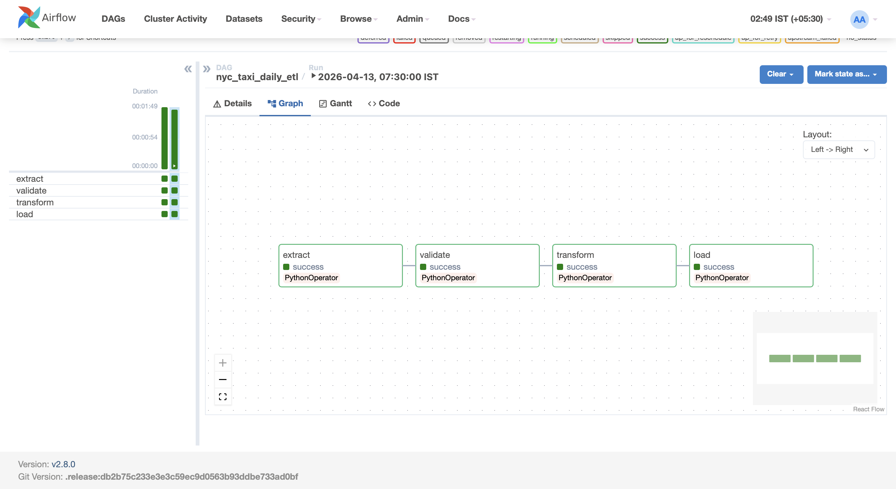
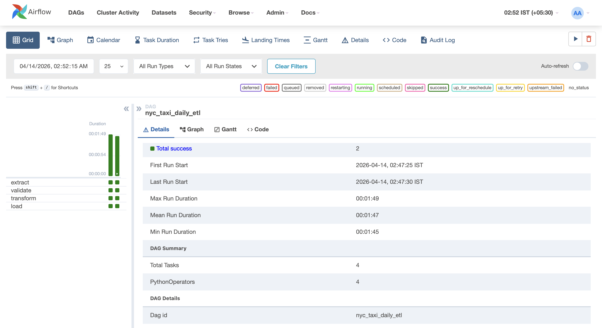
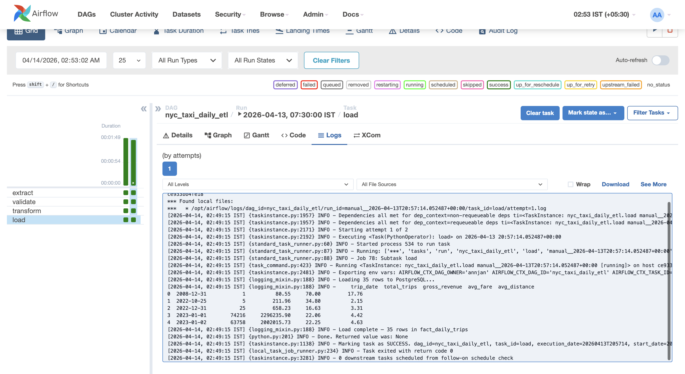
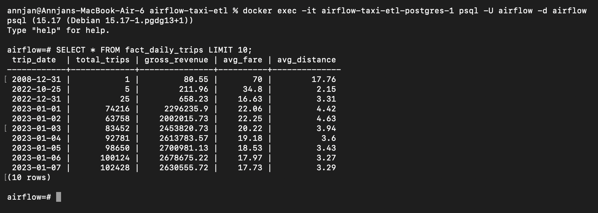

# 🚀 NYC Taxi ETL Pipeline using Apache Airflow

## 📌 Overview

This project demonstrates a **production-grade ETL pipeline** built using **Apache Airflow**, **Docker**, and **PostgreSQL**.

The pipeline:
- Extracts NYC TLC taxi data (Parquet)
- Validates data quality
- Transforms and aggregates it
- Loads it into a PostgreSQL warehouse

---

## 🧠 Architecture

Airflow Scheduler  
↓  
Extract (Parquet Data)  
↓  
Validate (Data Quality Checks)  
↓  
Transform (Cleaning + Aggregation)  
↓  
Load (PostgreSQL)

---

## ⚙️ Tech Stack

- Apache Airflow (2.8)
- Python (Pandas, PyArrow, SQLAlchemy)
- PostgreSQL
- Docker & Docker Compose

---

## 🔄 Pipeline Tasks

### 1. Extract
- Downloads NYC taxi dataset
- Stores raw parquet file

### 2. Validate
- Checks:
  - Required columns
  - Positive fare values
  - Data integrity

### 3. Transform
- Cleans invalid rows
- Handles schema differences
- Aggregates daily metrics:
  - total trips
  - revenue
  - average fare
  - distance

### 4. Load
- Loads into PostgreSQL table: `fact_daily_trips`
- Verifies row count

---

## ✅ Pipeline Success

### DAG Graph (All Tasks Successful)


### DAG Runs


### Task Logs


---

## 📊 Sample Output (PostgreSQL)



Example:

| trip_date | total_trips | gross_revenue | avg_fare | avg_distance |
|----------|------------|---------------|----------|--------------|
| 2023-01-01 | 15000 | 245000.50 | 16.2 | 3.4 |
| 2023-01-02 | 14800 | 240000.30 | 16.1 | 3.5 |

---
## How to Run

### 1. Start services
```bash
docker-compose up -d
```

### 2. Open Airflow UI
http://localhost:8080

Username: admin  
Password: admin  

### 3. Trigger DAG
- Enable DAG: `nyc_taxi_daily_etl`
- Click "Play" to run pipeline

---

## Sample Query

```sql
SELECT * FROM fact_daily_trips LIMIT 10;
```

---

## Project Structure

```
airflow-taxi-etl/
│
├── dags/
│   └── nyc_taxi_daily_etl.py
│
├── data/
│   ├── raw/
│   └── processed/
│
├── images/
│
├── docker-compose.yml
├── requirements.txt
└── README.md
```

---

## Resume Summary

Designed and implemented a fault-tolerant ETL pipeline using Apache Airflow, processing large-scale NYC taxi datasets with schema validation, transformation, and PostgreSQL integration.

---

## Future Improvements

- Add S3 for data storage
- Implement incremental loading
- Add Slack/email alerting
- Deploy on cloud (AWS/GCP)

---

## Author

Annjan Arora
