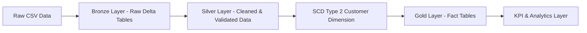

# 🏗️ Lakehouse Pipeline (Databricks + Delta Lake)

## 📌 Overview
This project demonstrates an end-to-end **Data Engineering pipeline** built using the Medallion Architecture (Bronze → Silver → Gold) on Databricks with Delta Lake.

It processes 100k+ e-commerce records from the Brazilian Olist dataset and showcases real-world data engineering practices including ingestion, transformation, dimensional modeling, and analytics.

---

## 🧠 Architecture

---

## ⚙️ Technology Stack
- PySpark
- Delta Lake
- Databricks
- SQL
- Data Modeling (Star Schema, SCD Type 2)

---

## 🏗️ Pipeline Layers

### 🟫 Bronze Layer
- Raw data ingestion from CSV
- Schema handling and audit columns
- Append-only Delta tables

### 🟪 Silver Layer
- Data quality validation:
  - Null checks
  - Domain validation
  - Future date validation
- Deduplication and transformation

### 🟦 SCD Type 2 (Customer Dimension)
- Historical tracking of customer attributes
- Hash-based change detection
- Delta MERGE operations
- Maintains:
  - effective_start_date
  - effective_end_date
  - is_current flag

### 🟩 Gold Layer
- Star schema modeling
- Fact table: fact_orders
- Dimension table: dim_customer
- KPI generation

---

## 📊 Key Metrics
- Total Orders
- Unique Customers
- Repeat Customers

---

## 📂 Dataset
Dataset: Brazilian E-Commerce (Olist)

Download:
https://www.kaggle.com/datasets/olistbr/brazilian-ecommerce

Note: Dataset is not included due to size constraints.

---

## 🚧 Challenges & Solutions
- Schema mismatch handling during ingestion
- Resolving ambiguous joins in Spark
- Handling Delta merge conflicts via deduplication
- Correcting customer grain mismatch (order vs user level)

---

## 📈 Future Enhancements
- Revenue and delivery KPIs
- Dashboard integration (Power BI/Tableau)
- Streaming data ingestion

---

## 🧾 Resume Summary
Built an end-to-end Lakehouse pipeline using Delta Lake with SCD Type 2 implementation and KPI generation on large-scale e-commerce data.

---

## 👨‍💻 Author
Annjan Arora
